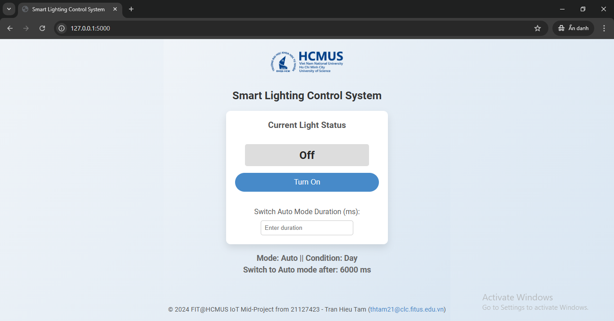

# HCMUS IoT - Smart Lighting Control System

## Overview
This project, developed as part of the IoT Programming course at the University of Science, VNU-HCM, focuses on creating a Smart Lighting Control System that automatically adjusts LED lighting based on ambient light conditions. The system operates in two modes: **Auto Mode** (light adjusts based on day/night) and **Manual Mode** (user-controlled via a push button or web interface). The aim is to provide energy efficiency and flexible lighting control.

## Features
- **Auto Mode**: LED automatically switches off in daylight and blinks at night.
- **Manual Mode**: Allows users to toggle the LED state manually.
- **Automatic Mode Switching**: Switches back to Auto Mode after a set duration or a day/night transition.
- **Web Interface**: Users can monitor the current LED state, adjust mode, set a timeout for Manual Mode, and manually control LED operations.

## Components
- **Controller**: Arduino Uno for control and data processing.
- **Sensors**: Photoresistor for light detection and a push button for mode toggling.
- **Web Service**: Local Flask-based web server, serving a simple interface to manage settings and LED control.

## System Design
Includes FSM diagrams, data flow between the controller and web service, and circuit diagrams for Arduino components.
<div align="center">


</div>

## Deployment
1. Code uploaded to Arduino using Arduino IDE.
2. Flask server set up for real-time data exchange between the web interface and Arduino.
<div align="center">


</div>

## Testing and Results
The system was tested in simulation (Tinkercad) and real hardware setups. Key tests included component-level validation, integration testing, and FSM behavior validation to ensure alignment with design specifications.

## Instructions

### Step 1: Connect Devices to Arduino
Connect the devices to the Arduino according to the designed circuit.

### Step 2: Upload Code to Arduino
Upload the code from `/Source/IoT-SmartLighting/IoT-SmartLighting.ino` to the Arduino via USB Port using the Arduino IDE. At this stage, the system will be running, but the web interface will not be available yet.

### Step 3: Run Flask Application
After uploading the code, close the Arduino IDE. Then, open a command prompt (CMD) in the `/Source` folder and run the following command:

```bash
flask --app app run
```
### Step 4. Access the Web Interface
After executing the command successfully, open the URL provided in the command prompt to access the web interface and start using the system.

### Customization
#### Arduino Communication
If you need to adjust the communication settings between the Arduino and the computer, you can do so by editing the `/Source/app.py` file.

#### Interface Customization
To modify the web interface, you can edit the following files:

- `/Source/static/style.css` for styling
- `/Source/templates/index.html` for layout and structure

## Release
- **Version**: 1.0
- **Release Date**: November 11, 2024
- [**Demo Video**](https://www.youtube.com/watch?v=MielNnFK-BU)
